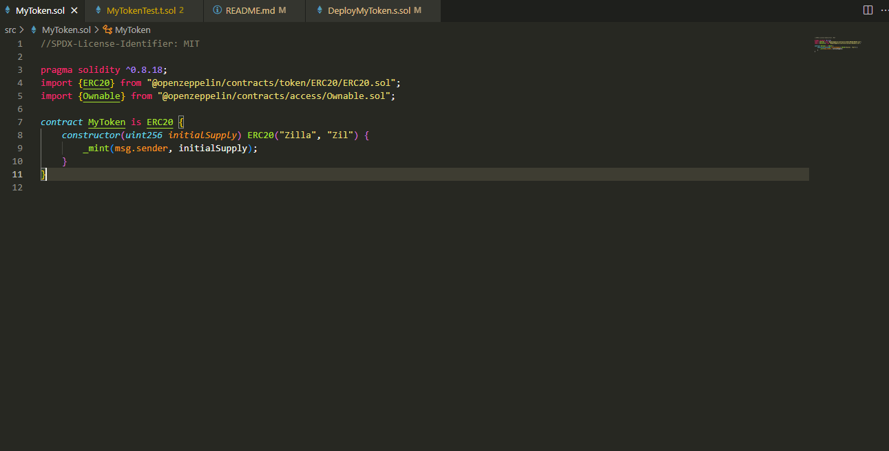
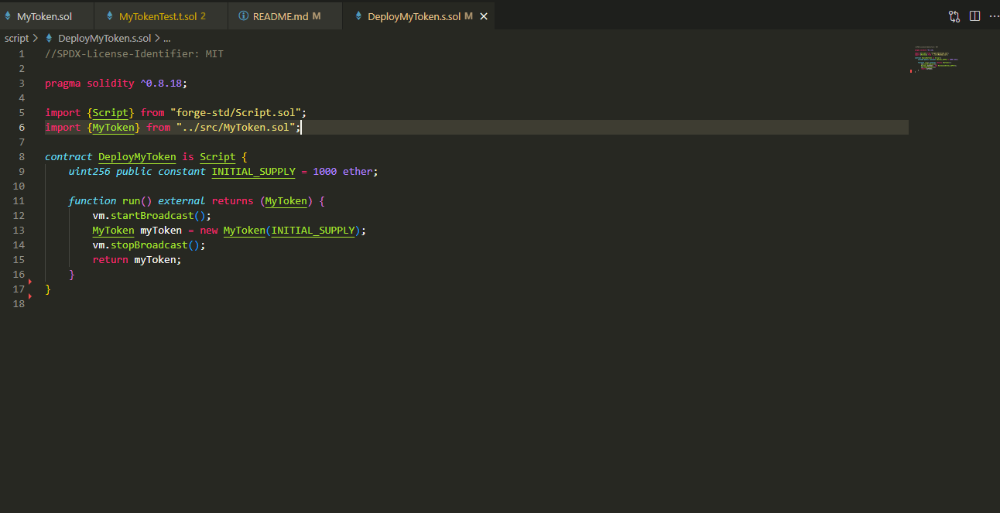
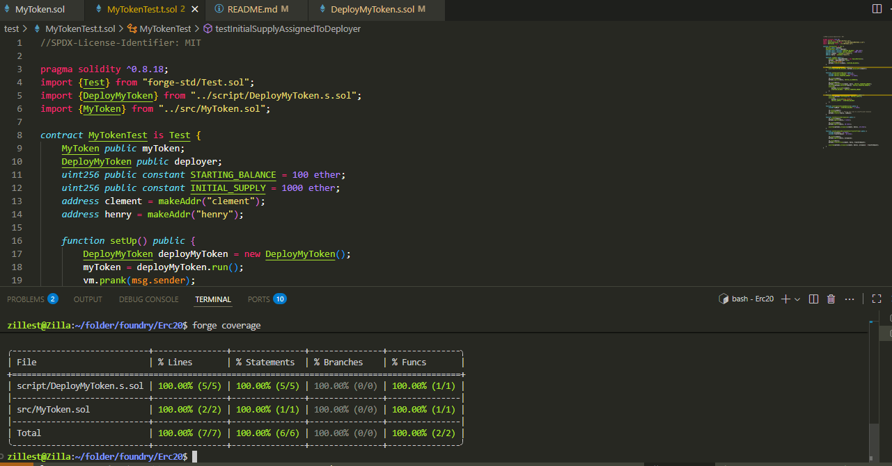

# Zilla (ZIL) Token

# 📸 Screenshot





An ERC-20 compliant smart contract built with Solidity and OpenZeppelin, structured using the Foundry development framework.

---

## 📌 Overview

Zilla (ZIL) is a standard ERC-20 token implemented for educational and development purposes. It demonstrates secure token creation, minting during contract deployment, and serves as a foundation for extending more advanced smart contract features.

---

## ⚙️ Stack & Tooling

- **Solidity** ^0.8.18
- **Foundry** (Anvil, Forge)
- **OpenZeppelin Contracts** v4.x
- **Ethereum (EVM)**

---

## 🔧 Features

- ✅ ERC-20 Standard Implementation
- ✅ Token minting in constructor (initial supply to deployer)
- ✅ Modular architecture for future upgrades (e.g., access control, mint/burn/pause logic)
- 🧪 Designed for full test coverage with Forge (coming soon)

## 🚀 Quick Start

### 1. Clone the repository

```bash
git clone https://github.com/yourusername/mytoken.git
cd mytoken

## Install Foundry (if not already installed)

curl -L https://foundry.paradigm.xyz | bash
foundryup

## Build the project
forge build

## Run tests (once available)
forge test


```
